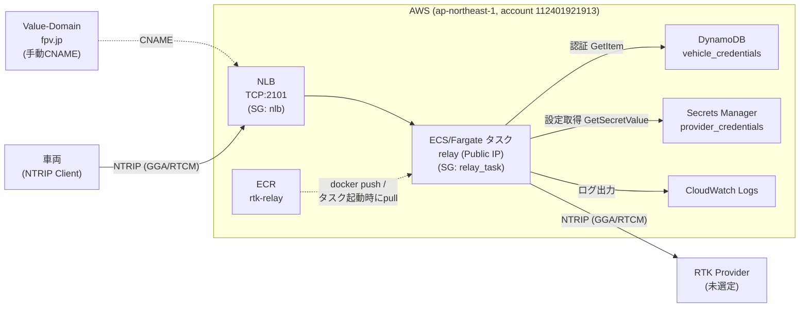
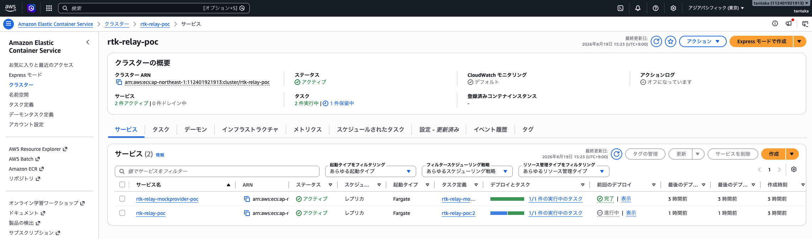

# RTK中継サーバ Terraform（POC）

[RTK中継サーバ 要件定義・設計ドキュメント.md](../../RTK中継/RTK中継サーバ%20要件定義・設計ドキュメント.md)のAWS構成案の実装。ECR
+ ECS/Fargate + NLB(TCP) + DynamoDB + Secrets Managerを作成する。デフォルトVPCを利用し、NAT
Gatewayコストを避けるためFargateタスクにPublic
IPを直接割り当てている（POC構成であり、本番では専用VPC・プライベートサブネット化を検討）。

## 構成図



-   **VPC/SG**：デフォルトVPCを利用。`nlb`SGが車両からの2101/tcpを許可し、`relay_task`SGは`nlb`SGからの2101/tcpのみ許可（インターネットから直接タスクへは到達不可）
-   **IAM**：`execution`ロール（ECR pull・ログ出力用、AWS管理ポリシー）と`task`ロール（DynamoDB
    `GetItem`とSecrets Manager
    `GetSecretValue`のみを許可するインラインポリシー）を分離
-   `terraform.tfstate`はリソースの実体を反映するが、Secrets Managerの中身（プロバイダー認証情報）はTerraformの管理外（[relay-server/README.md](../../relay-server/README.md)参照）

### ECS/Fargate


## 前提

-   `~/.aws/credentials`に`fpv-japan`プロファイルが設定済みであること
-   このプロファイルのIAMユーザーにECS/ECR/EC2(VPC)/IAM/DynamoDB/SecretsManager/ELBの権限が付与されていること

## 使い方

``` bash
terraform init
terraform plan
terraform apply
```

`apply`直後はECRにイメージが存在しないため、ECSサービスのタスクは起動に失敗する。`../relay-server/README.md`の手順でイメージをpushし、`--force-new-deployment`でタスクを再作成すること。

## 主な出力

-   `ecr_repository_url` — イメージのpush先
-   `nlb_dns_name` — 車両からの接続先（DNS設定の対象）
-   `vehicle_credentials_table_name` / `provider_credentials_secret_arn` — 認証情報投入先

## DNS（Value-Domain, fpv.jp）

TerraformはRoute53を使わず、AWS側は`nlb_dns_name`を出力するのみ。Value-Domainのコントロールパネルで、`var.relay_subdomain`（デフォルト`rtk.fpv.jp`）に対して以下のCNAMEを手動で追加する。AレコードではなくCNAMEにすること（NLBのIPは固定ではなく変わり得るため）。

    種別:  CNAME
    ホスト: rtk
    値:    <terraform output nlb_dns_name>（末尾に "." を付ける）

NLBのDNS名はサービス再作成では変わらないが、NLB自体を作り直した場合は変わるため、その際はCNAMEの再設定が必要。

## 破棄

検証が終わったら費用発生を止めるため destroy する。

``` bash
terraform destroy
```
