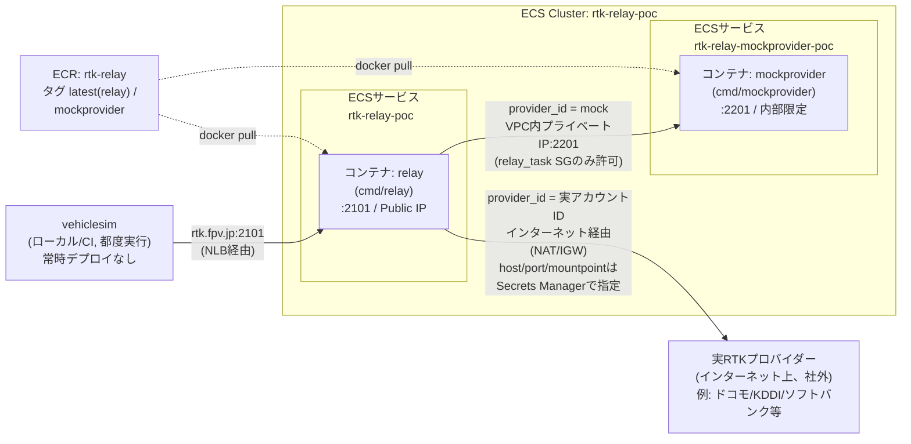
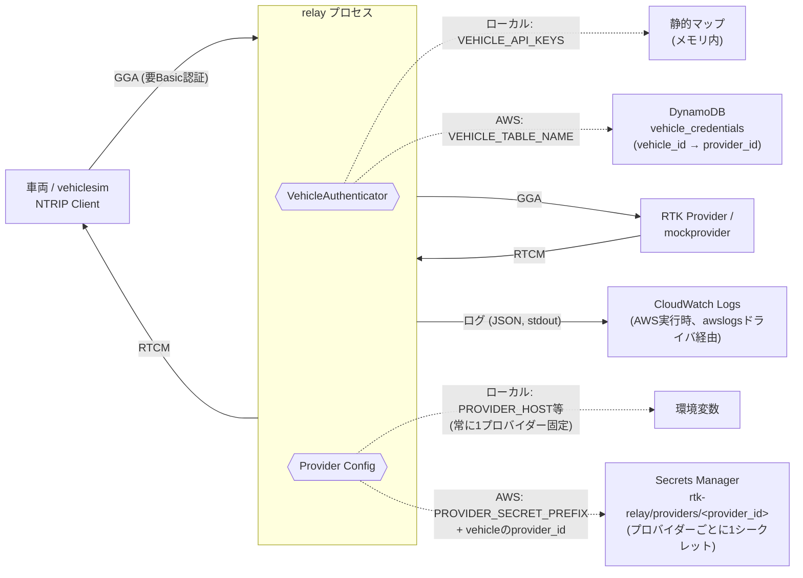
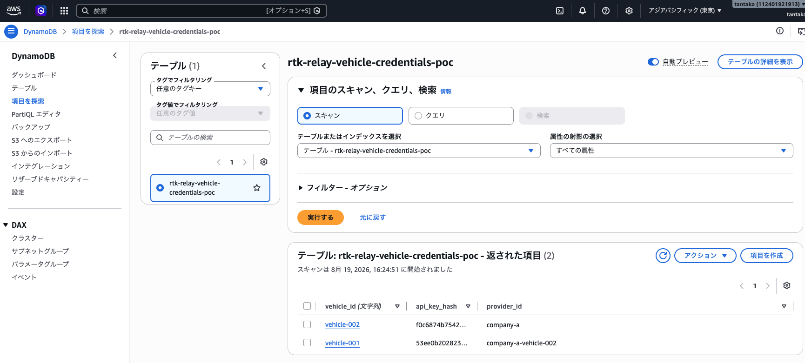

# rtk-relay (POC)

[RTK中継サーバ プロトコル・認証方式 詳細設計.md](../RTK中継サーバ%20プロトコル・認証方式%20詳細設計.md)
の実装。車両からのNTRIPセッションを受け、DynamoDBで認証した上でRTKプロバイダーへ中継する。

## 概要

3つのプログラムで構成される。

| プログラム | 役割 | 備考 |
|---|---|---|
| `cmd/relay` | 中継サーバ本体。車両からはNTRIP Caster、プロバイダーへはNTRIP Clientとして振る舞う（二重ロール） | 本プロジェクトではAWS ECS（`rtk-relay-poc`）上で常時稼働させる |
| `cmd/mockprovider` | RTKプロバイダーがまだ未選定のための代役 | ローカルでもAWS（`rtk-relay-mockprovider-poc`）でも動かせる。[RTKプロバイダー比較検討資料（Draft）.md](../RTKプロバイダー比較検討資料（Draft）.md)でプロバイダーが決まったら`infra/terraform`の`deploy_mockprovider = false`で撤去する |
| `cmd/vehiclesim` | 車両側NTRIP Clientの代役 | 常時稼働のサービスとしてはデプロイせず、手元やCIから都度実行する検証ツール。`RELAY_ADDR`でローカル/AWSどちらのrelayにも向けられる |

ローカルで`relay`/`mockprovider`を起動するかどうかは、AWS上の実体には影響しない。両者は同じコードから作られた別々のデプロイ先（自分のマシン上のプロセス
vs
ECS上のFargateタスク）として独立に動いており、`vehiclesim`がどちらと通信するかは接続先の`RELAY_ADDR`（`localhost:2101`か`rtk.fpv.jp:2101`か）で決まる。

### AWS上のコンテナ構成



同じECRリポジトリ（`rtk-relay`）から、タグ違いのイメージを2つのECSサービスとしてそれぞれ動かしている。`relay`はNLB経由でインターネットから`rtk.fpv.jp:2101`で到達可能だが、`mockprovider`は`relay_task`のセキュリティグループからしか到達できず、インターネットには非公開。

`relay`が実際にどちらへ中継するかは、接続してきた車両の`provider_id`（DynamoDB）で決まる（[RTK中継サーバ プロトコル・認証方式 詳細設計.md](../RTK中継サーバ%20プロトコル・認証方式%20詳細設計.md)の「プロバイダー設定スキーマ」参照）。`mock`ならこのVPC内の`mockprovider`へ、実プロバイダーのアカウントIDならSecrets Managerに登録したhost/port/mountpointをもとにインターネット経由で実プロバイダーへ接続する。`relay_task`は`assign_public_ip = true`でデフォルトVPCの各サブネットに配置されているため、インターネットへの直接アウトバウンド通信が可能（[infra/terraform/README.md](../infra/terraform/README.md)参照）。

> `mockprovider`タスクを再作成するとVPC内プライベートIPが変わる（Fargateの仕様上、固定できない）。Secrets
> Managerの`rtk-relay/providers/mock`に古いIPを設定したままだと`relay`が`no route to host`で502を返すので、`mockprovider`を再デプロイしたら[アドレスを取り直してSecretsを更新](#awsへのデプロイ)する必要がある（恒久対応するならService
> Discoveryの導入を検討）。`relay`はSecretsを都度引くので、この更新に`relay`の再デプロイは不要。

## AWSリソースとの関わり

`relay`プロセス自体はステートレスで、認証情報とプロバイダー設定は外部から注入される（ローカル実行は環境変数、AWS実行はDynamoDB/Secrets
Manager）。インフラ全体の構成図は[infra/terraform/README.md](../infra/terraform/README.md)を参照。



-   `VEHICLE_TABLE_NAME`/`PROVIDER_SECRET_PREFIX`が未設定ならローカル用の実装（静的マップ／環境変数、常に1プロバイダーのみ）にフォールバックする（[internal/auth/vehicle.go](internal/auth/vehicle.go)、[internal/providerconfig/config.go](internal/providerconfig/config.go)）
-   RTCM/GGAの中身はrelayが解釈せずそのまま中継する（[internal/relay/session.go](internal/relay/session.go)）
-   AWSモードでは、車両ごとにDynamoDBの`provider_id`からプロバイダーを解決する（**セッションを張るたびに**Secrets Managerを引く。起動時に1回だけ読む方式ではない）ため、プロバイダーの追加・変更に中継サーバの再デプロイは不要（車両の`provider_id`を更新し、対応するシークレットを作る/更新するだけでよい）
-   プロバイダー設定はhost/port/mountpoint/ID/PWだけでなく、NTRIPバージョンや追加ヘッダーなど各社固有のパラメータも保持できる（詳細は[RTK中継サーバ プロトコル・認証方式 詳細設計.md](../RTK中継サーバ%20プロトコル・認証方式%20詳細設計.md)の「プロバイダー設定スキーマ」）

## DynamoDBとSecrets Manager

車両側の認証情報とプロバイダー側の接続情報は、それぞれ別のAWSリソースで管理する（役割が異なるため：前者は「誰が接続してよいか」、後者は「どこに繋ぐか」）。

### DynamoDB（`vehicle_credentials`テーブル）

車両1台につき1アイテム。属性は3つだけ。

| 属性 | 説明 |
|---|---|
| `vehicle_id`（パーティションキー） | 車両を一意に識別するID |
| `api_key_hash` | 車両がNTRIP Basic認証で提示するAPIキーのSHA-256 hex（平文は保存しない） |
| `provider_id` | この車両が使うプロバイダーのアカウントを指す値。Secrets Managerの`rtk-relay/providers/<provider_id>`に対応する |

新規テーブルを増やすのではなく、この`provider_id`属性だけで「どの車両がどのプロバイダーアカウントを使うか」を表現している（実装は[internal/auth/vehicle.go](internal/auth/vehicle.go)）。

### Secrets Manager（`rtk-relay/providers/<provider_id>`）

**1アカウント = 1シークレット**が原則。多くのRTKプロバイダーは「1アカウント=同時接続1台まで」という契約になっているため（[RTKプロバイダー比較検討資料（Draft）.md](../RTKプロバイダー比較検討資料（Draft）.md)の「車両台数が多い場合のコスト構造」参照）、`provider_id`は会社名（`docomo`）ではなくアカウント単位（`docomo-vehicle-001`）で割り当て、車両が増えればシークレットも同じ数だけ増えていく想定。

シークレットの値は以下のJSON（詳細は[RTK中継サーバ プロトコル・認証方式 詳細設計.md](../RTK中継サーバ%20プロトコル・認証方式%20詳細設計.md)の「プロバイダー設定スキーマ」）。

``` json
{
  "host": "string (必須)",
  "port": "string (必須)",
  "mountpoint": "string (必須)",
  "username": "string (必須)",
  "password": "string (必須)",
  "ntrip_version": "\"1\" | \"2\" (省略時 \"2\")",
  "tls": "bool (省略時 false)",
  "gga_interval_seconds": "number (省略可)",
  "extra_headers": "object (省略可)"
}
```

`relay`のIAMタスクロールは`rtk-relay/providers/`プレフィックス配下への`GetSecretValue`をワイルドカードで許可されているため、新しいアカウントの追加はシークレットを1個作るだけで完結し、Terraformの変更も`relay`の再デプロイも不要（[infra/terraform/README.md](../infra/terraform/README.md)参照）。

## 動作確認

### ローカル

``` bash
docker compose up -d mockprovider relay
docker compose run --rm vehiclesim
```

`vehiclesim`のログに`received RTCM bytes`が継続的に出れば、GGA/RTCM双方向の中継が正常に動作している。

### AWS

ローカルでは何も起動せず、AWS上の`relay`/`mockprovider`に対して直接`vehiclesim`を実行できる（`vehicle-001`はDynamoDBに登録済みのテスト車両、[AWSへのデプロイ](#awsへのデプロイ)参照）。

``` bash
cd relay-server
RELAY_ADDR=rtk.fpv.jp:2101 VEHICLE_ID=vehicle-001 VEHICLE_API_KEY=dev-key-001 MOUNTPOINT=RELAY \
  go run ./cmd/vehiclesim
```

`session established with relay`のあと`received RTCM bytes`が継続的に出れば、AWS上のrelay/mockprovider共々正常に動作している。

## 設定（環境変数）

| 変数 | 説明 |
|---|---|
| `LISTEN_ADDR` | relayの待受アドレス（例: `:2101`） |
| `PROVIDER_SECRET_PREFIX` | 設定時、車両ごとの`provider_id`から`<prefix><provider_id>`という名前のSecrets Managerシークレットを都度解決する（本番/AWS向け） |
| `PROVIDER_HOST/PORT/MOUNTPOINT/USERNAME/PASSWORD` | `PROVIDER_SECRET_PREFIX`未設定時、これらの環境変数から直接読む（ローカル向け、常に1プロバイダー固定・`provider_id`は無視される） |
| `VEHICLE_TABLE_NAME` | 設定時、DynamoDBで車両認証を行う（本番/AWS向け）。各アイテムは`api_key_hash`に加えて`provider_id`が必須 |
| `VEHICLE_API_KEYS` | `VEHICLE_TABLE_NAME`未設定時、`vehicleID:apiKey:providerID,...`形式で直接指定（ローカル向け。`providerID`は`PROVIDER_HOST`等のローカル固定プロバイダーでは実際には使われない） |

## AWSへのデプロイ

インフラは`../infra/terraform`で管理する。イメージのビルド・pushは以下（Fargateは`linux/amd64`）。

``` bash
cd relay-server
aws ecr get-login-password --profile fpv-japan --region ap-northeast-1 \
  | docker login --username AWS --password-stdin <account-id>.dkr.ecr.ap-northeast-1.amazonaws.com

docker build --platform linux/amd64 --build-arg CMD=relay \
  -t <account-id>.dkr.ecr.ap-northeast-1.amazonaws.com/rtk-relay:latest .
docker push <account-id>.dkr.ecr.ap-northeast-1.amazonaws.com/rtk-relay:latest

aws ecs update-service --cluster rtk-relay-poc --service rtk-relay-poc \
  --force-new-deployment --profile fpv-japan --region ap-northeast-1
```

車両認証情報の登録例（`api_key_hash`はAPIキーのSHA-256 hex、`provider_id`はどのプロバイダーへ中継するかの割り当て）：

``` bash
printf "<api-key>" | shasum -a 256 | awk '{print $1}'

aws dynamodb put-item \
  --table-name rtk-relay-vehicle-credentials-poc \
  --item '{"vehicle_id": {"S": "vehicle-001"}, "api_key_hash": {"S": "<hash>"}, "provider_id": {"S": "<provider_id>"}}' \
  --profile fpv-japan --region ap-northeast-1
```

プロバイダーの追加・更新は、`<provider_id>`ごとに1つのSecrets Managerシークレットを作るだけでよい（Terraformの変更・中継サーバの再デプロイは不要。フィールドの意味は[RTK中継サーバ プロトコル・認証方式 詳細設計.md](../RTK中継サーバ%20プロトコル・認証方式%20詳細設計.md)の「プロバイダー設定スキーマ」参照）。

``` bash
# 新規プロバイダー
aws secretsmanager create-secret --name "rtk-relay/providers/<provider_id>" \
  --secret-string '{"host":"...","port":"2101","mountpoint":"...","username":"...","password":"...","ntrip_version":"2","extra_headers":{"X-Provider-Account":"..."}}' \
  --profile fpv-japan --region ap-northeast-1

# 既存プロバイダーの更新
aws secretsmanager put-secret-value --secret-id "rtk-relay/providers/<provider_id>" \
  --secret-string '{"host":"...","port":"2101","mountpoint":"...","username":"...","password":"..."}' \
  --profile fpv-japan --region ap-northeast-1
```

`relay`はセッション確立のたびにSecrets Managerを引くため、上記の更新だけで即座に反映される（`relay`自体の再デプロイは不要）。

### mockprovider再デプロイ後のアドレス更新

`mockprovider`を再デプロイ（`force-new-deployment`等）するとVPC内プライベートIPが変わるため、`rtk-relay/providers/mock`の値を更新しないと`502 Bad Gateway`になる（[AWS上のコンテナ構成](#aws上のコンテナ構成)参照）。

``` bash
TASK_ARN=$(aws ecs list-tasks --cluster rtk-relay-poc --service-name rtk-relay-mockprovider-poc \
  --profile fpv-japan --region ap-northeast-1 --query 'taskArns[0]' --output text)
PRIVATE_IP=$(aws ecs describe-tasks --cluster rtk-relay-poc --tasks "$TASK_ARN" \
  --profile fpv-japan --region ap-northeast-1 \
  --query 'tasks[0].attachments[0].details[?name==`privateIPv4Address`].value' --output text)

aws secretsmanager put-secret-value --secret-id "rtk-relay/providers/mock" \
  --secret-string "{\"host\":\"$PRIVATE_IP\",\"port\":\"2201\",\"mountpoint\":\"TESTMOUNT\",\"username\":\"relay\",\"password\":\"relay-secret\",\"ntrip_version\":\"2\",\"extra_headers\":{\"X-Provider-Account\":\"test-account-001\"}}" \
  --profile fpv-japan --region ap-northeast-1
```

（`X-Provider-Account`の値は`mockprovider`側の`MOCK_PROVIDER_REQUIRE_HEADER_VALUE`と一致させる必要がある。`relay`はSecretsを都度引くため、`relay`自体の再デプロイは不要）
